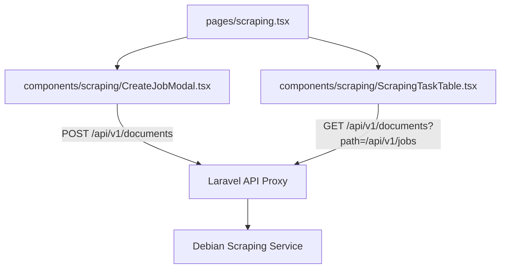
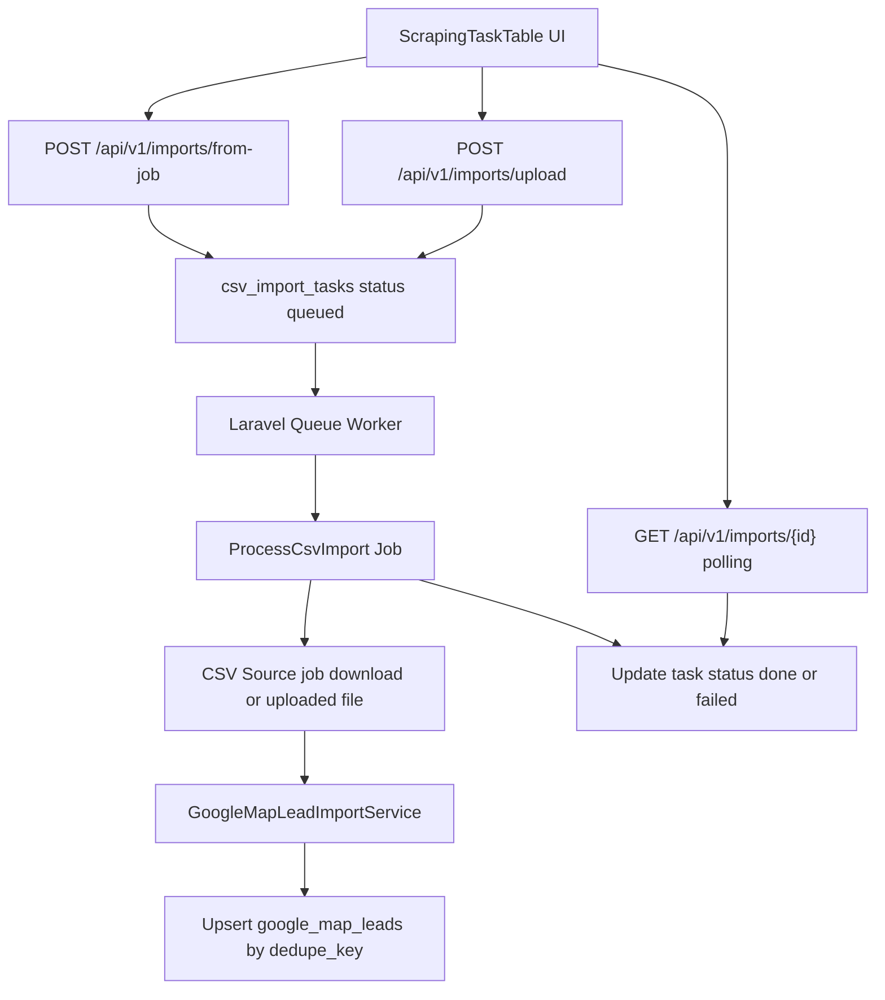
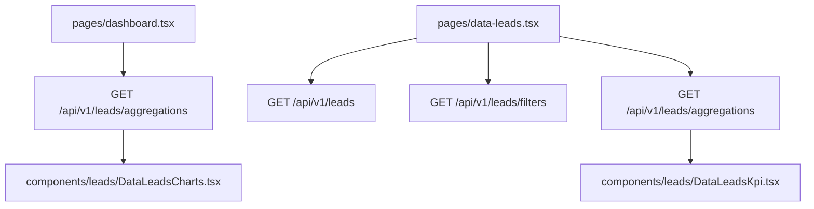

# Technical Documentation: pagpug-app Scraping Service Integration

## 1. Overview & References
`pagpug-app` adalah aplikasi internal berbasis **Laravel 12** dan **React (Inertia.js)**. Aplikasi ini bertindak sebagai *dashboard* antarmuka dan *proxy* untuk mengelola "Google Maps Scraping Service" yang berjalan di *local server* Debian terpisah. 

Proyek ini pada awalnya dibangun (*bootstrapped*) menggunakan bawaan resmi **`laravel/react-starter-kit`**, yang mana sudah mencakup konfigurasi awal untuk Vite, TailwindCSS, komponen UI, dan sistem navigasi/routing bawaan.

Karena alasan keamanan dan CORS, *frontend* React tidak pernah melakukan *request* langsung ke server Debian. Semua *request* dirutekan melalui *backend* Laravel (*API Proxy*).

### 1.1. API Specification Reference
Spesifikasi lengkap (OpenAPI/Swagger) mengenai *endpoint*, skema *request* (termasuk tipe data dan parameter wajib), serta *response* dari layanan *scraper* ini dapat dilihat pada file berikut:
* **File Path:** `Documentation\google-map-scraper-API-1.0.0\google-map-scraper-API-1.0.0.yaml`

---

## 2. Tech Stack & Requirements
* **Base Template:** `laravel/react-starter-kit`
* **Backend:** Laravel 12 (PHP)
* **Frontend:** React 18, Inertia.js, TailwindCSS
* **UI Components:** Shadcn UI (`table`, `dialog`, `input`, `label`, `switch`, `textarea`, `tabs`, `progress`, `scroll-area`, `badge`, `card`, `separator`, `tooltip`, `button`)
* **Icons:** Lucide React
* **External Target API:** `http://mydebian.local:8001` (Debian Server)

---

## 3. Environment Setup
Tambahkan variabel berikut pada file `.env` di Laravel untuk menentukan alamat server target:
```env
SCRAPING_SERVICE_API_URL="[http://mydebian.local:8001](http://mydebian.local:8001)"
```

---

## 4. Backend Configuration (Laravel)

### 4.1. Web Routes (`routes/web.php`)
Digunakan untuk melakukan *rendering* halaman React via Inertia.
```php
<?php
use Illuminate\Support\Facades\Route;
use Laravel\Fortify\Features;

Route::inertia('/', 'welcome', [
    'canRegister' => Features::enabled(Features::registration()),
])->name('home');

Route::middleware(['auth', 'verified'])->group(function () {
    Route::inertia('dashboard', 'dashboard')->name('dashboard');
    Route::inertia('scraping', 'scraping')->name('scraping'); // Halaman Scraping
});

require __DIR__.'/settings.php'; // Handle route /settings/profile bawaan starter kit
```

### 4.2. API Routes (`routes/api.php`)
Diaktifkan menggunakan `php artisan install:api`. Bertindak sebagai *endpoint* lokal untuk React.
```php
<?php
use Illuminate\Support\Facades\Route;
use App\Http\Controllers\Api\DocumentApiController;

Route::prefix('v1')->group(function () {
    Route::get('/documents', [DocumentApiController::class, 'index']);
    Route::post('/documents', [DocumentApiController::class, 'store']);
});
```

### 4.3. API Controller (`app/Http/Controllers/Api/DocumentApiController.php`)
Berfungsi sebagai *Proxy* HTTP Client ke server Debian.
```php
<?php
namespace App\Http\Controllers\Api;

use App\Http\Controllers\Controller;
use Illuminate\Http\Request;
use Illuminate\Support\Facades\Http;

class DocumentApiController extends Controller
{
    // GET: Mengambil daftar Jobs
    public function index(Request $request) {
        $path = $request->query('path', '/api/v1/jobs');
        $baseUrl = rtrim(env('SCRAPING_SERVICE_API_URL'), '/');
        $fullUrl = $baseUrl . '/' . ltrim($path, '/');

        $response = Http::get($fullUrl);
        return response()->json([
            'success' => $response->successful(),
            'data' => $response->json()
        ]);
    }

    // POST: Membuat Job baru
    public function store(Request $request) {
        $path = $request->query('path', '/api/v1/jobs');
        $baseUrl = rtrim(env('SCRAPING_SERVICE_API_URL'), '/');
        $fullUrl = $baseUrl . '/' . ltrim($path, '/');

        try {
            $response = Http::post($fullUrl, $request->all());
            if ($response->successful()) {
                return response()->json([
                    'success' => true,
                    'data' => $response->json()
                ], 201);
            }
            return response()->json([
                'success' => false,
                'message' => 'Failed to create job',
                'error' => $response->body()
            ], $response->status());
        } catch (\Exception $e) {
            return response()->json([
                'success' => false,
                'error' => $e->getMessage()
            ], 500);
        }
    }
}
```

### 4.4. Backend Architecture Pattern

Aplikasi menggunakan **Layered Architecture Pattern** dengan aliran data sebagai berikut:

```
Controller → Service → Repository → Model → Database
```

#### Penjelasan Lapisan:

1. **Controller** (`app/Http/Controllers/Api/`)
   - Entry point untuk HTTP request dari frontend
   - Validasi input request
   - Memanggil service untuk business logic
   - Mengembalikan JSON response
   - Contoh: `GoogleMapLeadController.php`

2. **Service** (`app/Services/`)
   - Memproses business logic
   - Mengelola validasi dan transformasi data
   - Memanggil repository untuk data operations
   - Mengembalikan data terformat
   - Contoh: `GoogleMapLeadService.php`

3. **Repository** (`app/Repositories/`)
   - Abstraksi data access layer
   - Implementasi query logic database
   - Menggunakan interface untuk dependency injection
   - Contoh: `GoogleMapLeadRepository.php` implements `GoogleMapLeadRepositoryInterface.php`

4. **Model** (`app/Models/`)
   - Eloquent ORM Model
   - Definisi fillable properties, casts, dan relasi
   - Contoh: `GoogleMapLead.php`

5. **Database**
   - PostgreSQL atau database yang dikonfigurasi
   - Tabel dan migrations

#### Contoh Alur Lengkap (GoogleMapLead):

```
GET /api/v1/leads
  ↓
GoogleMapLeadController::index()
  → validasi request
  ↓
GoogleMapLeadService::getPaginatedLeads()
  → proses business logic
  ↓
GoogleMapLeadRepository::paginate()
  → build query database
  ↓
GoogleMapLead Model::query()
  → Eloquent query builder
  ↓
Database (PostgreSQL)
  → return rows
```

#### Service Provider Binding (`app/Providers/AppServiceProvider.php`):

```php
public function register(): void
{
    $this->app->bind(
        GoogleMapLeadRepositoryInterface::class,
        GoogleMapLeadRepository::class,
    );
}
```

Ini memastikan dependency injection bekerja otomatis ketika service meminta `GoogleMapLeadRepositoryInterface`.

---

## 5. Frontend Configuration (React / Inertia)

### 5.1. Sidebar Navigation (`resources/js/components/app-sidebar.tsx`)
Penambahan menu navigasi utama.
```tsx
import { LayoutGrid, Globe, User } from 'lucide-react';

const mainNavItems: NavItem[] = [
    { title: 'Dashboard', href: '/dashboard', icon: LayoutGrid },
    { title: 'Scraping Jobs', href: '/scraping', icon: Globe },
    { title: 'Profile', href: '/settings/profile', icon: User }, // Menggunakan route bawaan settings.php
];
```

### 5.2. Page Component (`resources/js/pages/scraping.tsx`)
Halaman utama yang menampung Tabel dan Modal. Menggunakan *relative path* (`../`) untuk menghindari isu resolve import pada Vite.
```tsx
import { useState } from "react";
import { Head } from '@inertiajs/react';
import AppLayout from '@/layouts/app-layout';
import ScrapingTasksTable from '../components/ScrapingTaskTable';
import CreateJobModal from '../components/CreateJobModal';

export default function ScrapingPage() {
    const [refreshKey, setRefreshKey] = useState(0);

    const handleSuccess = () => setRefreshKey(prev => prev + 1);

    return (
        <AppLayout breadcrumbs={[{ title: 'Scraping Jobs', href: '/scraping' }]}>
            <Head title="Scraping Jobs" />
            <div className="flex h-full flex-1 flex-col gap-4 p-4">
                <div className="flex justify-between items-center">
                    <h1 className="text-2xl font-bold">Google Maps Scraping</h1>
                    <CreateJobModal onSuccess={handleSuccess} />
                </div>
                <div className="w-full">
                    <ScrapingTasksTable key={refreshKey} />
                </div>
            </div>
        </AppLayout>
    );
}
```

### 5.3. Data Table (`resources/js/components/scraping/ScrapingTaskTable.tsx`)
Melakukan `GET` ke `/api/v1/documents`.
**PENTING (Data Structure):** API Server Debian mengembalikan JSON dengan **Case-Sensitive Capitalization** (`ID`, `Name`, `Status`, `Date`, `Data`). TypeScript Interface *wajib* mengikuti struktur huruf kapital tersebut untuk menghindari error `undefined`.

### 5.4. Create Job Modal (`resources/js/components/scraping/CreateJobModal.tsx`)
Menggunakan `Dialog` dari Shadcn UI. Melakukan `POST` ke `/api/v1/documents`. Payload data harus disesuaikan dengan skema JSON yang dibutuhkan server Debian (termasuk konversi baris teks *keywords* menjadi `Array of Strings`).

---

## 6. Current State & Known Issues (April 2026)
* ✅ **Berhasil:** Halaman UI berhasil dirender menggunakan Vite dan Tailwind.
* ✅ **Berhasil:** Navigasi Sidebar dan Routing Inertia berjalan normal.
* ✅ **Berhasil:** API Proxy GET Request (`ScrapingTaskTable`) berhasil mengambil dan menampilkan data dari Debian Server. Resolusi isu menggunakan kapitalisasi JSON yang tepat.
* ❌ **Bermasalah:** Fitur **Create Jobs** (`CreateJobModal.tsx`) melalui method POST saat ini **gagal memproses pembuatan job baru**. Proses *debugging* masih berjalan pada payload JSON dan respons proxy.

---

## 7. Frontend Structure Refactor (April 2026)

Section ini mendokumentasikan perapihan struktur frontend terbaru pada `resources/js` agar onboarding, maintenance, dan pengembangan fitur baru tetap konsisten.

### 7.1. Tujuan Perapihan
- Memisahkan komponen berdasarkan domain/concern (bukan menumpuk di root `components`).
- Menjadikan `components/ui` sebagai sumber utama reusable primitives.
- Mengurangi kebingungan import path dan duplikasi file dengan nama sama.
- Menstandarkan alur page -> domain components -> API proxy backend.

### 7.2. Struktur Folder Frontend (Target Saat Ini)

```text
resources/js/
  app.tsx
  ssr.tsx
  pages/
    dashboard.tsx
    scraping.tsx
    auth/*
    settings/*
  layouts/
    app-layout.tsx
    app/*
    auth/*
    settings/*
  components/
    ui/*
    navigation/*
    layout/*
    branding/*
    profile/*
    scraping/
      CreateJobModal.tsx
      ScrapingTaskTable.tsx
  hooks/*
  types/*
  lib/*
```

### 7.3. Layering dan Tanggung Jawab

1. **Page Layer** (`pages/*`)
   - Entry point berdasarkan route Inertia.
   - Komposisi layout + domain component.
   - Contoh: `pages/scraping.tsx` menggabungkan `CreateJobModal` dan `ScrapingTaskTable`.

2. **Layout Layer** (`layouts/*` dan `components/layout/*`)
   - Menangani shell aplikasi (header/sidebar/container).
   - Tidak memuat logika bisnis scraping.

3. **Domain Component Layer** (`components/scraping/*`, `components/profile/*`, dst.)
   - Menangani UI + state domain tertentu.
   - `components/scraping/ScrapingTaskTable.tsx` untuk listing jobs + status.
   - `components/scraping/CreateJobModal.tsx` untuk input payload create job.

4. **UI Primitive Layer** (`components/ui/*`)
   - Komponen dasar reusable (button, table, dialog, badge, switch, dll).
   - Tidak menyimpan aturan bisnis domain.

### 7.4. Alur Data Halaman Scraping



### 7.5. Konvensi Import (Wajib)

#### A. Gunakan alias `@/` sebagai default
- Terapkan untuk lintas-folder agar konsisten dan mudah dipindahkan:
  - `@/components/...`
  - `@/layouts/...`
  - `@/hooks/...`
  - `@/types/...`
- Contoh aktual: `pages/scraping.tsx` mengimpor dari `@/components/scraping/*`.

#### B. Relative import hanya untuk lokal-sefolder
- Boleh dipakai jika file sangat dekat dan masih satu modul kecil.
- Hindari relative path panjang (`../../../`) karena rawan error saat refactor.

#### C. Satu komponen, satu lokasi kanonik
- Lokasi kanonik fitur scraping: `components/scraping/*`.
- Hindari membuat versi kedua dengan nama sama di root `components`.

### 7.6. Status Audit Perapihan (Temuan Penting)

- Struktur modular baru **sudah aktif** dan dipakai oleh `pages/scraping.tsx`.
- Masih ada **indikasi duplikasi/legacy file** di root `components` (contoh: `components/ScrapingTaskTable.tsx` dan `components/app-sidebar.tsx`) yang kontennya overlap dengan versi modular.
- Selama fase transisi, jadikan folder modular sebagai acuan utama, lalu rencanakan pembersihan file legacy agar tidak membingungkan tim.

### 7.7. Checklist Maintainability Setelah Refactor

- [ ] Setiap fitur baru ditempatkan di folder domain yang jelas (`components/<domain>`).
- [ ] Tidak menambah file komponen baru di root `components` tanpa alasan arsitektural.
- [ ] Gunakan alias `@/` untuk import lintas folder.
- [ ] Pastikan tidak ada dua file dengan nama dan peran sama di lokasi berbeda.
- [ ] Saat memindahkan file, update import di `pages/*` terlebih dulu.
- [ ] Verifikasi TypeScript/Lint setelah perubahan struktur.

### 7.8. Rekomendasi Langkah Lanjutan

1. Tentukan daftar file legacy yang akan dipertahankan vs dihapus.
2. Jalankan konsolidasi import agar seluruh page/domain mengarah ke lokasi kanonik modular.
3. Setelah konsolidasi selesai, update dokumentasi ini pada bagian changelog/refactor history.

---

## 8. Fitur Baru: Async CSV Import ke PostgreSQL (Queue-Based)

Section ini mendokumentasikan penambahan fitur import hasil scraping CSV ke PostgreSQL secara asynchronous.

### 8.1. Tujuan Fitur
- Menambahkan **bottom action** pada halaman scraping untuk:
  - Generate import dari job scraping yang sudah `finished`.
  - Upload CSV manual lalu import ke database.
- Menghindari data duplikat dengan strategi **upsert + deduplication key**.
- Menetapkan `lead_status` otomatis bernilai `New_lead` untuk data hasil import.

### 8.2. Endpoint API Baru
File: `routes/api.php`

- `POST /api/v1/imports/from-job`
  - Membuat task import dari `job_id` (worker akan pull CSV dari server Debian).
- `POST /api/v1/imports/upload`
  - Upload file CSV (`multipart/form-data`) dan membuat task import.
- `GET /api/v1/imports/{id}`
  - Mengambil status task untuk polling UI (`queued|processing|done|failed`).

Controller terkait:
- `app/Http/Controllers/Api/CsvImportController.php`

### 8.3. Queue Job & Service
- Job processor: `app/Jobs/ProcessCsvImport.php`
  - Mengubah status task ke `processing`.
  - Mengambil source CSV (upload atau pull dari job download).
  - Menjalankan parser/import service.
  - Menutup task sebagai `done` atau `failed`.

- Import service: `app/Services/GoogleMapLeadImportService.php`
  - Parse CSV header -> row mapping.
  - Normalisasi nilai numerik/string.
  - Serialisasi kolom JSON ke format aman untuk PostgreSQL JSONB.
  - Bulk `upsert` ke tabel lead berdasarkan `dedupe_key`.

### 8.4. Tabel Database Baru

1. `google_map_leads`  
   Migration: `database/migrations/2026_04_23_120000_create_google_map_leads_table.php`
   - Menyimpan 34 field data hasil scraping.
   - Kolom deduplikasi: `dedupe_key` (unique).
   - Kolom status bisnis dari source tetap di `status`.
   - Kolom internal pipeline: `lead_status` default `New_lead`.

2. `csv_import_tasks`  
   Migration: `database/migrations/2026_04_23_120100_create_csv_import_tasks_table.php`
   - Tracking lifecycle import task:
     - source type (`job`/`upload`)
     - status task
     - total/processed/failed rows
     - error message
     - metadata dan timestamp proses

Model terkait:
- `app/Models/GoogleMapLead.php`
- `app/Models/CsvImportTask.php`

### 8.5. Alur Data End-to-End



### 8.6. Perubahan Frontend
- File utama: `resources/js/components/scraping/ScrapingTaskTable.tsx`
- Penambahan:
  - pemilihan job siap import (status finished/completed/success/ok),
  - tombol `Generate dari Job`,
  - tombol `Upload CSV`,
  - polling status task import dan menampilkan ringkasan hasil.

### 8.7. Operational Notes
- Worker queue **harus aktif** agar task `queued` diproses:
  - `php artisan queue:work`
- Jika task berhenti di `queued`, penyebab paling umum adalah worker belum berjalan.
- Jika task `failed`, cek:
  - `storage/logs/laravel.log`
  - kolom `error_message` pada tabel `csv_import_tasks`.

### 8.8. Anti-Duplicate Strategy
- Record key utama: `dedupe_key` (unique index di database).
- Seed dedupe key:
  1. `place_id` (prioritas utama),
  2. fallback `cid`,
  3. fallback `data_id`,
  4. fallback gabungan identitas (`title|phone|address|link`).
- Dengan upsert, data lama akan di-update, bukan insert duplikat.

---

## 9. Fitur Baru: Data Leads Page, Detail Page, dan Chart Aggregation

Section ini mendokumentasikan fitur halaman `Data Leads` sebagai layer analitik untuk data pada tabel `google_map_leads`.

### 9.1. Tujuan Fitur
- Menambahkan navigasi khusus `Data Leads` di sidebar aplikasi.
- Menyediakan halaman tabel leads dengan kemampuan:
  - fetching data,
  - total count,
  - server-side pagination (chunking),
  - filtering,
  - sorting,
  - search.
- Menyediakan halaman detail per lead (`/data-leads/{id}`) dengan UI Shadcn.
- Menyediakan endpoint agregasi untuk kebutuhan KPI dan visualisasi chart pada halaman dashboard.

### 9.2. Backend Endpoints
File: `routes/api.php`  
Controller: `app/Http/Controllers/Api/GoogleMapLeadController.php`

- `GET /api/v1/leads`
  - List data leads dengan query parameter:
    - `page`, `per_page`, `q`, `lead_status`, `category`, `timezone`,
    - `sort_by`, `sort_dir`,
    - `date_from`, `date_to`.
  - Response:
    - `data` (items),
    - `meta` (`total`, `per_page`, `current_page`, `last_page`, `from`, `to`).

- `GET /api/v1/leads/aggregations`
  - Mengembalikan KPI dan dataset chart:
    - total leads,
    - total New lead,
    - average rating,
    - distinct category,
    - status distribution,
    - top categories,
    - timezone distribution,
    - daily trend,
    - rating buckets,
    - data completeness (phone/website).

- `GET /api/v1/leads/filters`
  - Distinct options untuk dropdown filter (`lead_statuses`, `categories`, `timezones`).

- `GET /api/v1/leads/{id}`
  - Mengambil detail satu lead untuk halaman detail.

### 9.3. Routing dan Navigation (Inertia)
- File route web: `routes/web.php`
  - `Route::inertia('data-leads', 'data-leads')`
  - `Route::get('data-leads/{id}', ...)->name('data-leads.detail')`
- Sidebar navigation:
  - File: `resources/js/components/navigation/app-sidebar.tsx`
  - Menambahkan item menu `Data Leads`.

### 9.4. Frontend Components (Shadcn-first)
- Page list: `resources/js/pages/data-leads.tsx`
- Page detail: `resources/js/pages/data-leads-detail.tsx`
- Domain components:
  - `resources/js/components/leads/DataLeadsFilters.tsx`
  - `resources/js/components/leads/DataLeadsTable.tsx`
  - `resources/js/components/leads/DataLeadsKpi.tsx`
  - `resources/js/components/leads/DataLeadsCharts.tsx`
  - `resources/js/components/leads/DataLeadDetail.tsx`
  - `resources/js/components/leads/types.ts`

Semua layout/container utama memanfaatkan komponen Shadcn (`Card`, `Table`, `Badge`, `Button`, `Select`, `Input`, `Separator`) agar konsisten dengan desain sistem aplikasi.

### 9.5. Chart Aggregation yang Digunakan
Untuk memastikan data visual lebih rapih dan mudah dibaca, agregasi menggunakan kombinasi chart berikut:

- **Bar Chart**
  - Top Categories
  - Data Completeness
- **Line Chart**
  - Daily Trend
- **Area Chart**
  - Timezone Distribution
- **Pie / Donut Chart**
  - Lead Status Distribution
- **Radar Chart**
  - Review Rating Buckets

Library chart:
- Dependency: `recharts`
- Integrasi pada file: `resources/js/components/leads/DataLeadsCharts.tsx`

### 9.6. Halaman Detail Lead
Halaman detail `/data-leads/{id}` menampilkan section:
- Identity & Contact
- Location & Links
- Reviews & Metrics
- Raw JSON blocks (`about`, `open_hours`, `user_reviews`, `images`, `emails`, `user_reviews_extended`)
- Activity/Audit

Setiap field memiliki fallback `-` atau empty state agar tetap aman saat data parsial/null.

### 9.7. Alur Data Data Leads
```mermaid
flowchart TD
  sidebarDataLeads[Sidebar DataLeads] --> leadsPage[pages/data-leads.tsx]
  leadsPage --> listApi[GET /api/v1/leads]
  leadsPage --> aggApi[GET /api/v1/leads/aggregations]
  leadsPage --> filterApi[GET /api/v1/leads/filters]
  leadsPage --> detailRoute[data-leads/{id}]
  detailRoute --> detailPage[pages/data-leads-detail.tsx]
  detailPage --> detailApi[GET /api/v1/leads/{id}]
  listApi --> leadController[GoogleMapLeadController]
  aggApi --> leadController
  filterApi --> leadController
  detailApi --> leadController
  leadController --> leadsTable[(google_map_leads)]
  aggApi --> kpiUi[DataLeadsKpi]
```

### 9.8. Catatan Teknis
- Pagination tetap server-side (chunking) agar aman untuk volume data besar.
- `per_page` dibatasi maksimal 200 untuk mencegah query berat.
- Sorting sudah di-whitelist untuk mencegah kolom arbitrary.
- Untuk skala data lebih besar, pertimbangkan penambahan index pada kolom filter/sort populer (`lead_status`, `category`, `timezone`, `created_at`).

---

## 10. Update Arsitektur UI: Chart Dipindah ke Dashboard (April 2026)

Section ini mendokumentasikan perubahan layout analytics terbaru agar pemisahan concern lebih jelas antara halaman operasional data dan halaman monitoring.

### 10.1. Ringkasan Perubahan
- Chart agregasi leads dipindahkan dari halaman `Data Leads` ke halaman `Dashboard`.
- Halaman `Data Leads` sekarang fokus pada:
  - KPI ringkas,
  - filter,
  - tabel data,
  - pagination dan sorting.
- Komponen chart tetap menggunakan file yang sama (`DataLeadsCharts.tsx`) tanpa duplikasi.

### 10.2. File yang Diubah
- `resources/js/pages/data-leads.tsx`
  - Menghapus import `DataLeadsCharts`.
  - Menghapus render `<DataLeadsCharts data={aggregations} />`.
- `resources/js/pages/dashboard.tsx`
  - Menambahkan state `aggregations`, `loading`, `error`.
  - Menambahkan `useEffect` untuk fetch endpoint `/api/v1/leads/aggregations`.
  - Merender `DataLeadsCharts` pada dashboard dengan fallback loading/error.

### 10.3. Alur Data Setelah Perubahan


### 10.4. Dampak dan Manfaat
- Dashboard menjadi pusat visual monitoring (chart analytics).
- Data Leads menjadi lebih fokus untuk aktivitas eksplorasi data tabular.
- Reusability komponen tetap baik karena chart memakai komponen domain yang sama.

---

## 11. Redesign UI: DataLeadDetail — Premium Customer Dashboard (April 2026)

Section ini mendokumentasikan perombakan total komponen halaman detail lead (`DataLeadDetail.tsx`) dari layout sederhana menjadi dashboard customer premium dengan UX yang kaya.

### 11.1. Ringkasan Perubahan
- Komponen `DataLeadDetail.tsx` di-*rewrite* seluruhnya.
- UI sebelumnya berupa deretan `Card` + `DetailRow` sederhana, kini menjadi dashboard interaktif dengan hero header, KPI metrics, tabbed navigation, star rating visual, rating distribution bars, copy-to-clipboard, dan timeline activity.
- Menambahkan 3 komponen Shadcn UI baru ke project.

### 11.2. Komponen Shadcn UI Baru yang Ditambahkan
Dipasang melalui `npx shadcn@latest add`:

| Komponen | File | Fungsi |
|---|---|---|
| `Tabs` | `components/ui/tabs.tsx` | Navigasi tab untuk memisahkan section detail |
| `Progress` | `components/ui/progress.tsx` | Bar distribusi rating per bintang |
| `ScrollArea` | `components/ui/scroll-area.tsx` | Scroll container untuk JSON blocks & user reviews |

### 11.3. Arsitektur Sub-Komponen Internal
File: `resources/js/components/leads/DataLeadDetail.tsx`

Komponen ini sekarang memiliki sub-komponen internal berikut:

| Sub-Komponen | Fungsi |
|---|---|
| `CopyButton` | Tombol copy-to-clipboard dengan feedback visual (✓) selama 1.5 detik |
| `StarRating` | Render bintang visual dengan dukungan *fractional fill* (mis. 4.3 → 4 bintang penuh + 30% parsial) |
| `InfoRow` | Baris informasi dengan ikon, label, value, opsional copy button dan link eksternal |
| `MetricCard` | Kartu KPI dengan ikon, animasi hover (scale + gradient overlay), dan subtitle |
| `RatingDistribution` | Bar chart horizontal per rating (5→1) menggunakan `Progress` bar dari Shadcn |
| `JsonBlock` | Blok JSON terformat dalam `ScrollArea` dengan header dot-indicator |

Fungsi helper:
- `statusColor()` — Mapping warna badge dinamis berdasarkan `lead_status` (new, contacted, qualified, converted, lost).
- `formatDate()` — Format tanggal ke locale Indonesia (`id-ID`) dengan jam dan menit.

### 11.4. Struktur UI Baru

#### A. Hero Header
- Gradient accent strip di bagian atas card.
- Judul lead besar (h1) dengan `Badge` status berwarna dinamis.
- Metadata ringkas: kategori (ikon Tag) dan alamat (ikon MapPin).
- Nomor telepon dengan tombol copy.
- Rating card di sisi kanan: angka besar + star visual + total review.

#### B. KPI Metric Cards (4 kolom grid)
- **Rating** — Nilai rating out of 5.0
- **Reviews** — Jumlah total review
- **Website** — Ketersediaan website
- **Phone** — Ketersediaan telepon

Setiap kartu memiliki efek hover: scale-up ikon + gradient overlay.

#### C. Tabbed Navigation (5 tab)

| Tab | Ikon | Konten |
|---|---|---|
| **Identity** | `User` | Business name, category, phone (copyable), website (clickable link + copyable), address, status, lead_status, emails |
| **Location** | `MapPin` | Coordinates (lat/lng), plus code, Google Maps link (clickable), Place ID, CID — disusun dalam 2 kolom |
| **Reviews** | `Star` | Rating breakdown besar + `RatingDistribution` progress bars + scrollable user review cards dengan avatar inisial |
| **Raw Data** | `Building2` | JSON blocks grid 2 kolom: About, Open Hours, User Reviews, Images, Emails, User Reviews Extended, Reviews per Rating |
| **Activity** | `Clock` | Timeline visual (created/updated) dengan dot indicators + copyable IDs (Lead ID, Input ID, Data ID, Timezone) |

### 11.5. Fitur Interaktif

1. **Copy-to-Clipboard**
   - Tersedia pada field: phone, website, address, business name, coordinates, Place ID, CID, Google Maps link, dan semua IDs.
   - Tombol copy muncul saat hover (opacity transition).
   - Feedback visual: ikon berubah menjadi ✓ hijau selama 1.5 detik.

2. **External Links**
   - Website dan Google Maps link di-render sebagai anchor `<a>` dengan `target="_blank"`.
   - Auto-prefix `https://` jika belum ada.
   - Ikon `ExternalLink` sebagai indikator visual.

3. **Star Rating Visual**
   - Render 5 bintang dengan dukungan fill parsial per-pixel.
   - Warna: amber-400 (filled) vs muted (unfilled).

4. **User Reviews Scroll**
   - Maksimal 10 review terakhir ditampilkan.
   - Setiap review card memiliki avatar inisial, nama, rating bintang, dan teks review.
   - `ScrollArea` height 288px untuk area scroll terbatas.

5. **Hover Effects**
   - `InfoRow`: background muted pada hover.
   - `MetricCard`: scale-up ikon + gradient overlay.
   - Copy button: opacity transition dari 0 ke 100.

### 11.6. Dependency Lucide Icons yang Digunakan
```
Building2, Calendar, Check, Clock, Copy, ExternalLink,
Globe, Mail, MapPin, MessageSquareText, Phone, Star, Tag, User
```

### 11.7. Catatan Teknis
- Semua field dari tipe `Lead` yang berasal dari index signature `[key: string]: unknown` harus di-cast secara eksplisit (misalnya `as string`, `as number`) atau menggunakan `String()` untuk menghindari error TypeScript `Type 'unknown' is not assignable to type 'ReactNode'`.
- Null-check menggunakan `!= null` (bukan `&&`) untuk menghindari *falsy* trap pada value `0` atau `""`.
- Komponen bersifat *read-only display* — tidak ada state mutation terhadap data lead.

